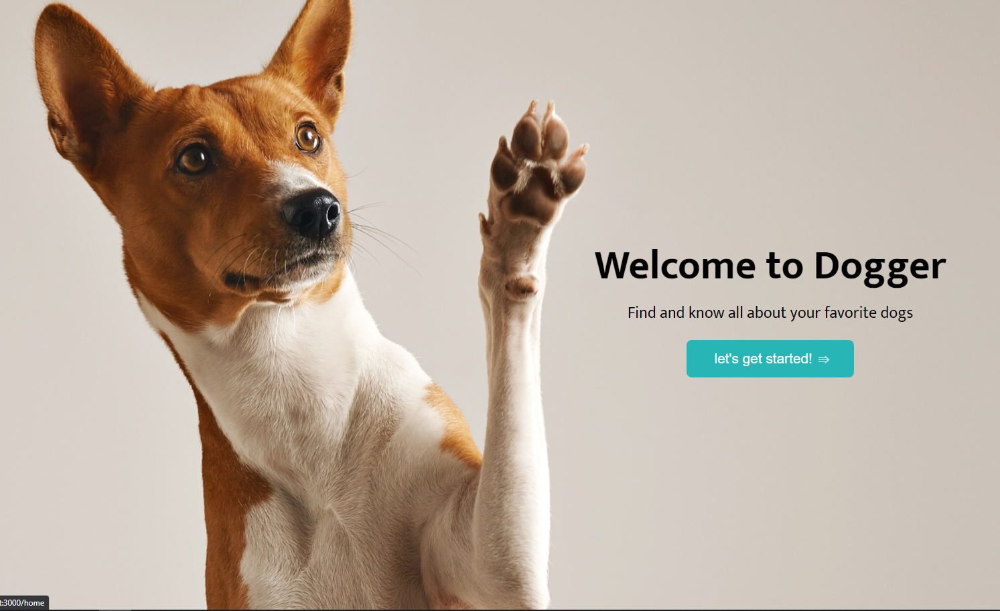
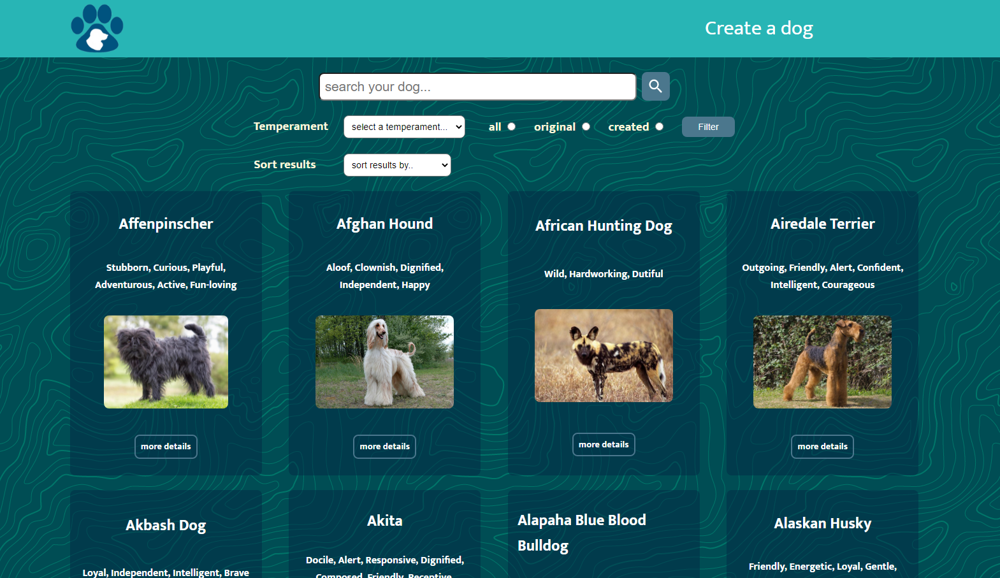

# Dogger App

<p align="left">
  
</p>

## Introduction

>Dogger is an app to know everything about your favorite dog breeds, in it you can search for a breed, filter results by their temperament, if they are existing breeds in our database or if you created them yourself. You can also sort them alphabetically or by weight in ascending and descending order.
You can access a detailed view of each breed of dog and you also have a form to create your own breed!

## App snaps

> Here are some snapshots of our running application
<p align="left">
  
</p>

<p align="right">
  
</p>

## Installation

__IMPORTANT__: to properly run this app on your machine you have to know the database is build with PostgreSQL and with Sequelize as ORM, the code is entirely develop with this technologies, feel free to use whatever DB you want on a previously forked repo.

>First clone this repository to your machine
```
git clone https://github.com/emilianoagustin/PI-Dogs-FT13.git
```

>If you want to run this app locally you have to install dependencies for the backend inside api folder and then inside client folder:
```
npm install
```

>Then inside api folder to start your server:
```
npm start
```

>Then inside client folder to start your frontend app:
```
npm start
```
